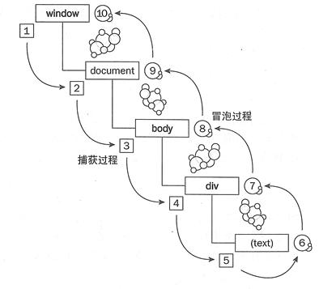

## DOM
<!-- TOC -->  
- [1. DOM事件级别](#1-dom事件级别)   
- [2. DOM事件模型](#2-dom事件模型)    
- [3. DOM事件流](#3-dom事件流)a    
- [4. 描述DOM事件捕获的具体流程](#4-描述dom事件捕获的具体流程)   
- [5. JS获取DOM的CSS样式](#5-js获取dom的css样式)   
- [6. DOM操作](#6-dom操作) 
- [7. document.createTextNode(), document.write(), innerHTML的区别](#7-documentcreatetextnode-documentwrite-innerhtml的区别)   
- [8. Window 对象 与 document 对象的关系](#8-window-对象-与-document-对象的关系)  
- [9. 一些题目](#9-一些题目)
<!-- /TOC -->
### 1. DOM事件级别
- DOM0级处理事件就是将一个函数赋值给一个事件处理属性
   - onXXX类型的定义事件
   - 如 : btn.onclick = function(e) { ... }
- DOM2级事件在DOM0级时间段额基础上弥补了一个处理程序无法同时绑定多个处理函数的缺点,允许给一个程序添加多个处理函数
    - addEventListener方式
    - element.addEventListener('click', function (e) { ... }) // IE8以下版本不支持
    - btn.removeEventListener('click', func, false) // IE8以下版本不支持
    - btn.attachEvent("onclick", func);
    - btn.detachEvent("onclick", func); 

### 2. DOM事件模型
从上到下捕获，从下到上冒泡。先捕获，找到目标，再冒泡，如图 :


### 3. DOM事件流
DOM标准采用捕获和冒泡。两种事件流都会触发DOM的所有对象，从window对象开始，也在window对象结束。

DOM标准规定事件流包括三个阶段：
- 事件捕获阶段
- 处于目标阶段
- 事件冒泡阶段

### 4. 描述DOM事件捕获的具体流程
从 window => document => html => body => ... => 目标元素

### 5. JS获取DOM的CSS样式
```js
function getStyle(obj, attr){
  if(obj.currentStyle){
    return obj.currentStyle[attr];// 旧版本IE浏览器适用
  } else {
    return window.getComputedStyle(obj, false)[attr];
  }
}
```

### 6. DOM操作
- 创建节点
  - createDocumentFragment() // 创建一个 DOM 片段
  - createElement() // 创建一个具体的元素
  - createTextNode() // 创建一个文本节点

- 添加
  - appendChild() 

- 移除
  - removeChild()

- 替换
  - replaceChild()

- 插入
  - insertBefore()

- 查找
  - getElementsByTagName() // 通过标签名称
  - getElementsByName() // 通过元素的 Name 属性的值(IE 容错能力较强，会得到一个数组，其中包括 id 等于 name 值的)
  - getElementById() // 通过元素 Id，唯一性

### 7. document.createTextNode(), document.write(), innerHTML的区别
- document.write 只能重绘整个页面， innerHTML 可以重绘页面的一部分
- document.createTextNode()与innerHTML的区别：innerHTML和createTextNode都可以把一段内容添加到一个节点中 ，若添加的内容里包含标签（eg：<strong>Hello!</strong>），createTextNode会把strong标签当做文本处理，输出的是"<strong>Hello!</strong>"，而innerHTML会当做一段代码处理，输出的是"Hello!"

### 8. Window 对象 与 document 对象的关系
window :
 - Window 对象表示当前浏览器的窗口，是 JavaScript 的顶级对象
 - 我们创建的所有对象、函数、变量都是 Window 对象的成员
 - Window 对象的方法和属性是在全局范围内有效的

document :
 - Document 对象是 HTML 文档的根节点与所有其他节点（元素节点，文本节点，属性节点，注释节点）
 - Document 对象使我们可以通过脚本对 HTML 页面中的所有元素进行访问
 - Document 对象是 Window 对象的一部分，即 window.document

### 9. 一些题目
1. 用JavaScript实现鼠标对小球的拖拽
```html
<!DOCTYPE html>
<html lang="en">
<head>
    <meta charset="UTF-8">
    <meta name="viewport" content="width=device-width, initial-scale=1.0">
    <title>mouseball</title>
    <style>
        div{
            background-color: cadetblue;
            width: 100px;
            height: 100px;
            border-radius: 50%;
            position: absolute;
            left: 0;
            top: 0;
        }
    </style>
</head>
<body>
    <div></div>
</body>
<script>
    function drag(e){
        var event = e || window.event // 实现多种浏览器兼容
        var disX = event.clientX - this.offsetLeft //当前鼠标在区块上的横向相对位置
        var disY = event.clientY - this.offsetTop //当前鼠标在区块上的纵向相对位置
        var that = this // 保存this对象，因为执行下面代码会改变this指向
        // 鼠标移动
        document.onmousemove = function(e) {
            var x = e.clientX - disX // 鼠标横向移动的位置
            var y = e.clientY - disY // 鼠标纵向移动的位置
            that.style.left = x + 'px'
            that.style.top = y + 'px'
        }
        // 鼠标离开
        document.onmouseup = function(e) {
            document.onmousemove = null
            document.onmouseup = null
        }
    }
    var myball = document.getElementsByTagName('div')[0]
    myball.onmousedown = drag
</script>
</html>
```

2. 点击任何一个元素，返回它在事件冒泡时所经过的元素，如果元素有id，那么打印id；如果有className，那么打印className；否则打印小写标签名
```js
function getCssSelecter(ele){
    var result = []
    while(ele){
      var e = ele.id ? '#' + ele.id 
      : (ele.className ? '.' + ele.className.split(' ').join('.') 
      : ele.tagName.toLowerCase())
      result.push(e)
      ele = ele.parentElement
    }
    return result
}
```

3. 找第n个兄弟节点: 封装函数，返回元素e的第n个兄弟节点，n为正，返回后面的兄弟节点，n为负，返回前面的，n为0，返回自己
```js
function findSiblings(ele,n){
    while(ele && n){
      if(n > 0 && ele.nextElementSibling){
        n--
        ele = ele.nextElementSibling
      }else if(ele.previousElementSibling){
        n++
        ele = ele.previousElementSibling
      }
    }
    return ele
}
```

4. 封装函数insertAfter(): 实现一个insertAfter()，功能类似insertBefore(); 即如果后面有节点，那就对后面那个节点执行insertBefore();如果是最后一个节点，那就使用appendChild() 方法
```js
Element.prototype.insertAfter = function(newNode, existNode) {
    var nextNode = existNode.nextElementSibling
    if(nextNode){
      this.insertBefore(newNode, nextNode)
    }else{
      this.appendchild(newNode)
    }
}  
```

5. 将目标节点内部的节点顺序，逆序输出 div a em => div em a
```js
function reverseChildrens (parent){
  var lastChild = parent.lastElementChild
  var pre
  while(pre = lastChild.previousSibling){
    var temp = parent.removeChild(pre)
    parent.appendChild(temp)
  }
}
```